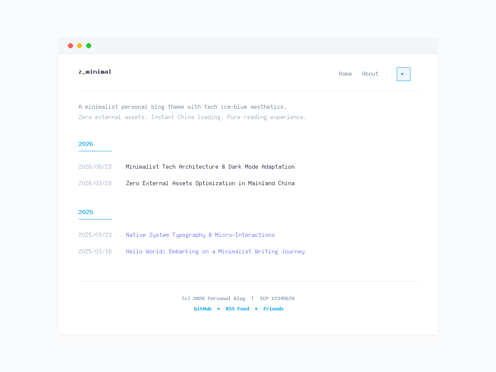

一个利用AI生成的个人博客极简范主题，版权没有，随意复制修改使用，以下是AI生成的内容。

截图仅供参考，详细效果请查看：https://zoco.me/

# z_minimal

> 一个极致纯净、轻量优雅的 WordPress 个人博客主题。专为内容写作与阅读打造，零外部依赖，毫秒级秒开。



---

## ✨ 特性一览

- ⚡ **零外部资源依赖（Zero External Assets）**：完全不引入 Google Fonts、cdnjs、FontAwesome 等境外资源；禁用 WordPress 默认远程 Emoji 脚本，中国大陆网络环境下秒开无白屏。
- 🧊 **科技简约风淡蓝配色**：
  - **浅色模式**：极净科技纸白（`#fafbfc`）+ 冰雾微蓝底色（`#f0f7ff`）+ 冰川浅蓝强调色（`#0ea5e9`）；
  - **深色模式**：深邃极夜黑蓝（`#080c14`）+ 冰晶柔蓝点缀（`#7dd3fc`），久看护眼。
- 🌓 **单一 Icon 三态外观切换**：顶部右侧轻巧图标按钮，点击平滑循环切换 `💻 跟随系统` -> `☀️ 浅色模式` -> `🌙 深色模式`；`<head>` 内置 Anti-FOUC 防闪烁脚本，刷新或切换页面绝无闪烁。
- 📅 **首页全量按年归档（不分页）**：自动抓取所有已发布文章并按年份（`2026年`、`2025年`...）聚合倒序排列，格式精确对齐 `YYYY/MM/DD 文章标题`。
- 📐 **像素级等宽日期对齐**：采用 `font-feature-settings: "tnum" 1`，文章日期数字犹如标尺般整齐划一。
- 🔗 **超链接可视化强化与已访问状态区分（`:visited`）**：
  - 未点击链接呈现冰川浅蓝 + 下划线；
  - 已点击/已阅读的链接与首页文章标题自动转为**科技紫罗兰已读色**，已读内容一目了然。
- ↗️ **站外链接自动新窗口打开**：文章正文中的非本站链接自动添加 `target="_blank"` 与 `rel="noopener noreferrer"` 安全防劫持属性，站内链接保持当前页平滑跳转。
- 🖼️ **图文排版深度优化**：消除段落与图片的多重外边距堆叠；图片说明文字（`figcaption`）绝对居中，字号弱化分层。
- ⚡ **原生图片懒加载与异步解码（Lazy Loading & Async Decoding）**：服务端自动为所有图片注入 `loading="lazy"` 与 `decoding="async"`，配合 CSS 平滑淡入，大幅提升长图文加载效率，零外部 JS 负担。
- 📊 **自适应数据表格与多媒体**：文章表格在移动端支持横向滑动，边框与深浅色模式自动适配。
- 🚫 **全局彻底关闭评论**：主题级关闭评论接口，模板剔除评论模块，后台与工具栏全面净化。
- ⚙️ **可视化后台配置**：
  - 顶部主菜单与底部链接支持在【外观】->【菜单】中自由拖拽；
  - 首页多行简介（支持自由换行）、ICP 备案号（直链工信部官网）、公安备案号、自定义版权声明均可在【外观】->【自定义】中直接填写；
  - 支持后台可视化添加**页眉/页脚多组统计分析代码**（如百度统计、Google Analytics、Meta 验证等）。
- 🎯 **全站严格 SEO 语义化**：严苛遵循每个页面仅有唯一 `<h1>` 标签，全站结构符合 HTML5 与 Schema.org 标准。
- 🖨️ **打印与导出 PDF 优化（Print CSS）**：快捷键打印时自动隐藏导航与页脚，转为高对比度黑白专业阅读排版。

---

## 🚀 安装指南

### 方法一：通过 Git Clone（推荐）

进入您的 WordPress 主题目录：
```bash
cd /path/to/wordpress/wp-content/themes/
git clone https://github.com/zocoxx/wordpress-theme-z_minimal.git z_minimal
```

### 方法二：手动安装

1. 点击仓库右上角的 **Code** -> **Download ZIP** 下载主题包；
2. 将压缩包解压并重命名文件夹为 `z_minimal`；
3. 将 `z_minimal` 上传至服务器的 `/wp-content/themes/` 目录下；
4. 登录 WordPress 管理后台，进入【外观】->【主题】，找到 **z_minimal** 点击【启用】即可。

---

## 🛠️ 后台设置说明

### 1. 导航菜单设置
- 进入【外观】->【菜单】；
- 创建菜单并勾选对应的显示位置：
  - **顶部主菜单 (Header Menu)**：展示在页面顶部右侧；
  - **底部链接菜单 (Footer Links)**：展示在备案号上方，可放置 GitHub、RSS 订阅、友链等。

### 2. 博客个性化配置
进入【外观】->【自定义】->【博客个性化设置】：
- **首页顶部多行简介**：输入个人简介文本，支持直接回车换行；
- **工信部 ICP 备案号**：填入备案号，前台自动生成链接指向工信部官网 `beian.miit.gov.cn`；
- **公安联网备案号**：可选填入公网安备号；
- **自定义版权声明**：可自定义文字，留空则默认自动输出 `© 当前年份 站点名称`；
- **页眉/页脚自定义代码**：可直接粘贴百度统计、Google Analytics、站长验证等代码片段，保存即刻全站生效。

---

## 📁 目录结构

```text
z_minimal/
├── AGENTS.md           # 架构、规范与后续迭代指引
├── README.md           # 项目使用与配置说明文档
├── style.css           # 主题元信息与纯原生 CSS 样式表
├── functions.php       # 功能钩子、菜单/Customizer/SEO/外链处理
├── header.php          # 语义化头部与三态外观切换组件
├── footer.php          # 语义化底部与备案号版权
├── index.php           # 首页多行简介与按年全量归档列表
├── single.php          # 文章详情页模板
├── page.php            # 通用独立页面模板
├── 404.php             # 简易优雅的 404 错误页
└── screenshot.png      # 主题预览封面图
```

---

## 📄 开源许可

本项目基于 [GPL-2.0 or later](http://www.gnu.org/licenses/gpl-2.0.html) 协议开源。
